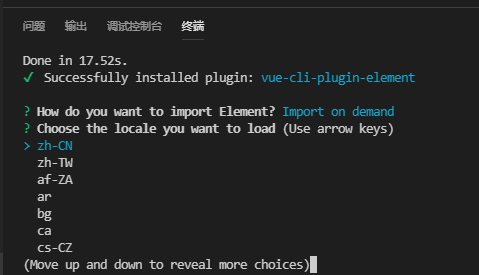
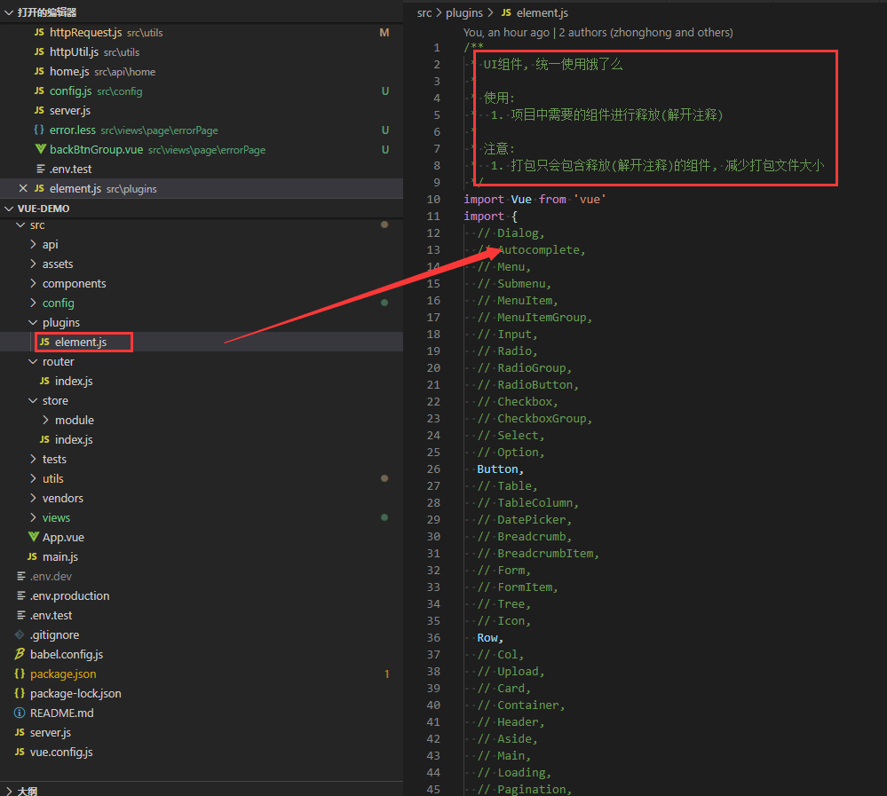
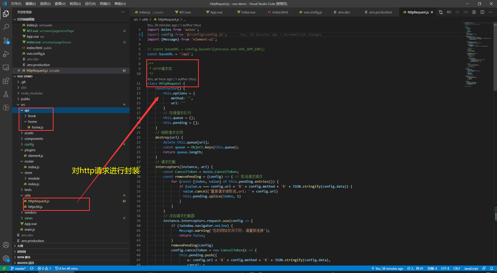
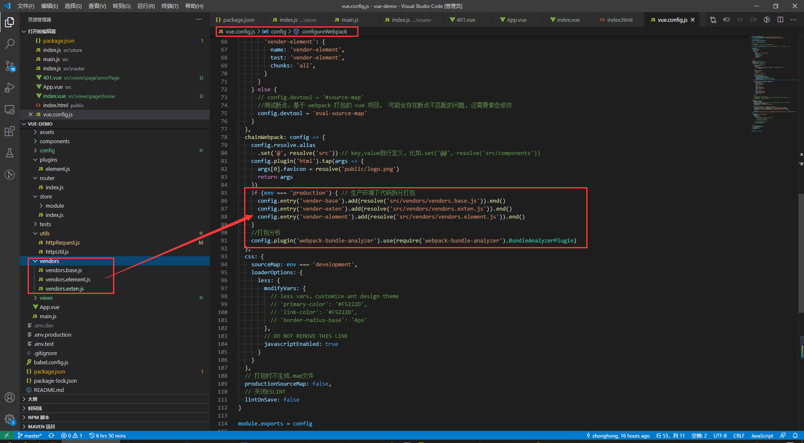

# 配置Vue开发环境

## 安装node

下载地址：http://nodejs.cn/download/

# vue-cli脚手架

> 版本要求
>
> node 8.9+

## 安装

```shell
npm install -g @vue/cli
# OR
yarn global add @vue/cli
```

检查其版本是否正确：

```shell
vue --version
```

## 创建项目

```shell
vue create vue-domo
```

## 项目结构

结合项目需求，规范了项目结构

```

    ├── 
    ├── public  打包所需静态资源
    └── src
        ├── api     后端接口api请求目录
        └── assets  项目静态资源
            ├── css  css
            └── img  图片资源
        ├── components  公共组件
        ├── config  开发相关配置
            └── config.js   项目运行配置
        ├── plugins  第三方插件相关配置
            └── element.js   element ui配置
        ├── utils  封装工具函数
        ├── router  路由配置
        ├── store  Vuex配置
        ├── vendors  拆分打包配置
        ├── view  页面文件
            ├── common     公共模块
            ├── module     模块
            └── page       页面
        └── tests  测试相关
    └── vue.config.js VUE-CLI配置文件
    └── server.js 本地服务器运行生产环境
```


# 配置vue-router

## 安装

```shell
npm i vue-router -S
```

## 新增 src/router/index.js

```javascript
import Vue from 'vue';
import Router from 'vue-router';

Vue.use(Router)
const router = new Router({
  mode: 'hash',
  routes: [
    {
      path: '/',
      redirect: '/home'
    }, 
    {
      path: '/home',
      name: 'Home',
      component: () => import('@/views/home/index.vue')
    },
    {
      path: '/500',
      name: 'error_500',
      component: () => import('@/views/errorPage/500.vue')
    },
    {
      path: '/401',
      name: 'error_401',
      component: () => import('@/views/errorPage/401.vue')
    },
    {
      path: '*',
      name: 'error_404',
      component: () => import('@/views/errorPage/404.vue')
    }
  ]
})

export default router
```

## 修改 main.js

```javascript
import Vue from 'vue';
import App from './App.vue';
import router from './router';
import store from './store';
// 引入element-UI
import './plugins/element.js';
// 引入公共样式
import '@/assets/css/index.css';

Vue.config.productionTip = false; // 阻止启动生产消息

new Vue({
    router,
    store,
    render: h => h(App),
  }).$mount('#app');
```


# 配置vuex

## 安装

```shell
npm i vuex -S
```

## 新增 src/store/index.js

```javascript
import Vue from 'vue';
import Vuex from 'vuex';
import app from './module/app';

Vue.use(Vuex);

const debug = process.env.NODE_ENV !== 'production';

export default new Vuex.Store({
  modules: {
    app
  },
  strict: debug
})
```

# 整合Element UI

## 安装

```shell
vue add element
```

出现选择全部引入还是按需引入，此时我们选择按需引入，Import on demand


然后选择zh-CN



## 如何按需引入



# 使用axios

## 安装

```javascript
npm i axios -S
```

## 使用



# 支持less

```shell
npm install --save-dev less-loader@5.0.0

npm install --save-dev less
```


# 启用gzip压缩

## 安装

```javascript
npm install --save-dev compression-webpack-plugin
```

## 新建 vue.config.js

```javascript
// Begin 生成 gzip 压缩文件
config.plugins.push(
    new CompressionWebpackPlugin({
        test: productionGzipExtensions,
        threshold: 1024, //对超过10k的数据进行压缩
        deleteOriginalAssets: false, //是否删除源文件
    })
);
```

## nginx 开启 gzip

```shell
http:{ 

    gzip on; 

    gzip_static on;

    gzip_buffers 4 16k;

    gzip_comp_level 5;

    gzip_types text/plain application/javascript text/css application/xml text/javascript application/x-httpd-php image/jpeg image/gif image/png;

}
```

# 代码拆分打包



# 解决跨域问题

## nginx反向代理

```shell
server {
    listen       80;
    server_name  localhost;
    ## 用户访问 localhost，则反向代理到https://www.ihuaben.com
    location / {
        root   html;
        index  index.html index.htm;
        proxy_pass https://www.ihuaben.com;
    }
}
```


## 前端设置服务器代理

修改 `vue.config.js`

```javascript
devServer: {
    proxy: {
      '/api': {
        target: 'http://localhost:8083', // 代理域名 + 端口
        ws: true,
        changeOrigin: true,
        secure: false,
        pathRewrite: {
          '^/api': ''
        }
      }
    }
}
```

## 服务端允许跨域

```java
@Component
public class SimpleCORSFilter implements Filter {

    public void doFilter(ServletRequest req, ServletResponse res, FilterChain chain) throws IOException, ServletException {

        HttpServletResponse response = (HttpServletResponse) res;

        response.setHeader("Access-Control-Allow-Origin", "*");

        response.setHeader("Access-Control-Allow-Methods", "POST, GET, OPTIONS, DELETE, HEAD");

        response.setHeader("Access-Control-Max-Age", "3600");

        response.setHeader("Access-Control-Allow-Headers", "access-control-allow-origin, authority, content-type, version-info, X-Requested-With");

        chain.doFilter(req, res);

    }

    public void init(FilterConfig filterConfig) {}

    public void destroy() {}

}
```

